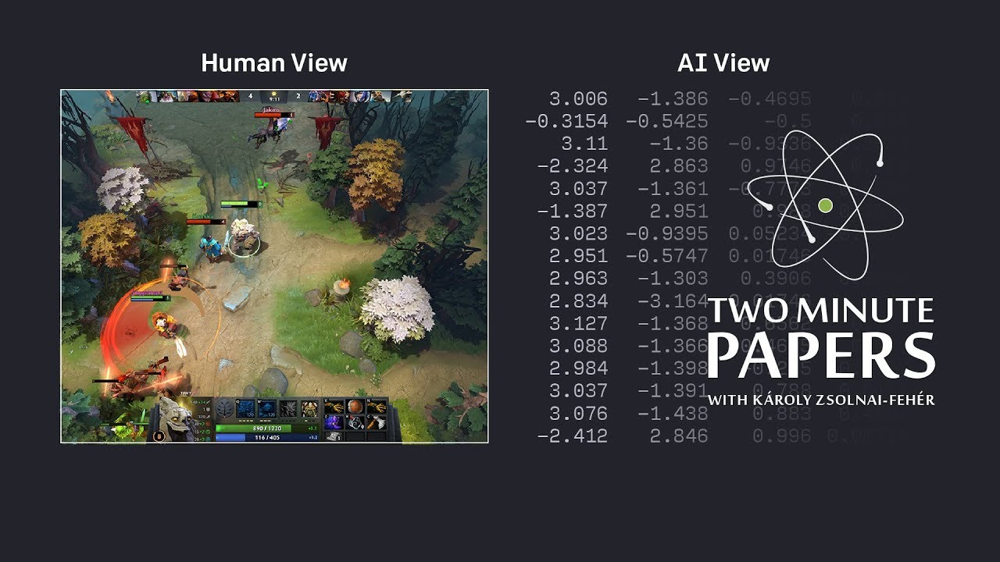
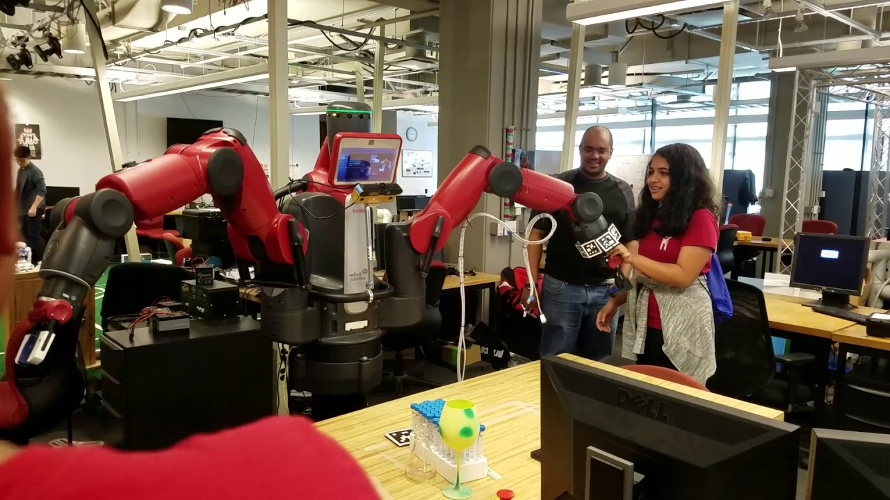

# Hello
I'm Andrew, a third year undergraduate student at the University of Melbourne.

I like to play Dota, and I became interested in Machine Learning after OpenAI revealed their Dota AI.

Now I am doing research in Reinforcement Learning for robotic control with UPenn's GRASP Lab.

I am also a part of the Computing and Information Systems Student Association as the education officer.

You can contact me through

email: andrew.shen1@unimelb.edu.au

LinkedIn: https://www.linkedin.com/in/andrew-shen-141443177