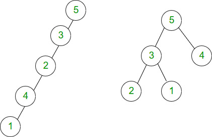
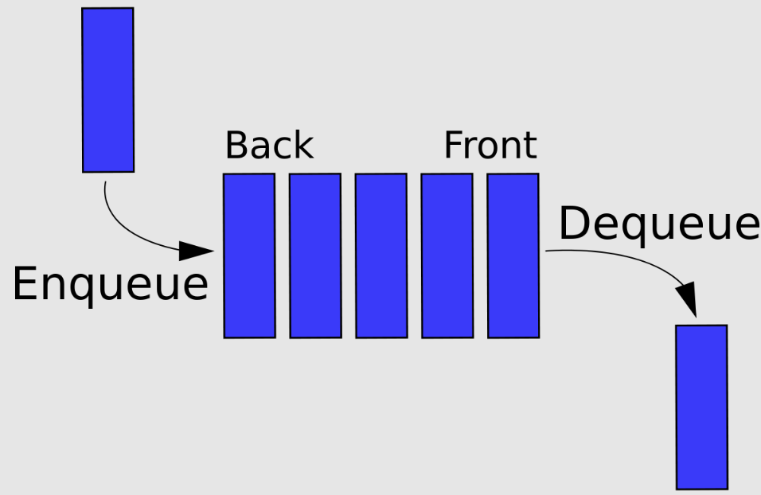

# Linked Lists and Trees
One of the question I get asked is why do we need to use dynamic memory? Dynamically sized arrays are a good example. Linked lists and trees are other examples of data structures that are impossible to create without dynamic memory. They are all data structures that grow with each insertion.

### Linked List


Data structure of a list
```
typedef struct node node_t;

struct node {
	data_t data;
	node_t *next;
};
```

To implement a queue efficiently, we also want to keep track of the foot of the linked list.

```
typedef struct {
	node_t *head;
	node_t *foot;
} list_t;
```

A simple list should implement the following operations

```
insert_at_head(list, data);
get_head(list, data);
```

More operations can be supported

```
insert_at_index(list, i);
get_at_index(list, i);
delete_at_index(list, i);
...
```

### Binary Trees


A binary tree is a data structure, where each node has two children.

```
typedef struct node node_t;

struct node {
	data_t data;
	node_t *left;
	node_t *right;
};
```

A binary search tree is arranged so: for each node, it's value is bigger than the value of it's left child and it's value is smaller than the value of it's right child. (Depending on convention, the left or right child can have a value equal to the parent).

```
node.left.data <= node.data < node.right.data
```

A binary search tree is constructed by adding one node at a time to the tree. The first item in the sequence becomes the head of the tree. Each subsequence item is inserted into it's appropriate place in the tree. In the simplest implementation, once inserted, the item remains in the same place in the tree.



In the best case, n items can be arranged in a tree with depth approx log2(n). Another way to think about it, a tree with depth of d can hold 2^(1+d) - 1 nodes at most. It turns out, given a list of random values, the depth of the search tree is O(log(n)).

But in the worst case, imagine if the list is sorted: the search tree will have depth n.

| Operation | Best Case | Worst Case |
| - | - | - |
| Insertion | O(log(n)) | O(n) |
| Search | O(log(n)) | O(n) |

### Stacks
Last In First Out


Operations
```
push(stack, data);
data = pop(stack);
```

### Queues
First In First Out



Operations
```
put(stack, data);
data = get(stack);
```

### Modules
We can write our own libraries/modules. You need to create two files, a c file and a header file.

* mymodule.c
* mymodule.h
* main.c

Then in your main c file you can include your new module with 

```
include "mymodule.h"
```

Note that the header file name is enclosed with "" instead of the usual <> used for standard libraries.

The header file contains function prototypes and struct definitions, necessary for you main file to know how to call functions in your module.