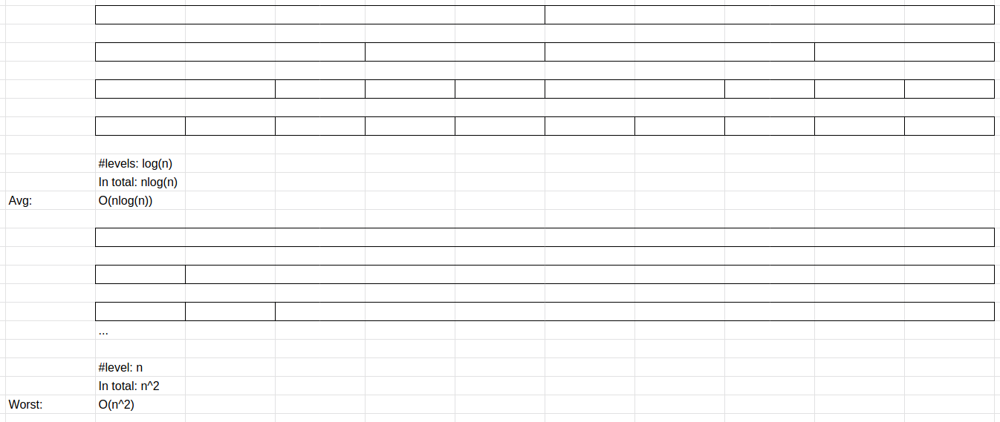
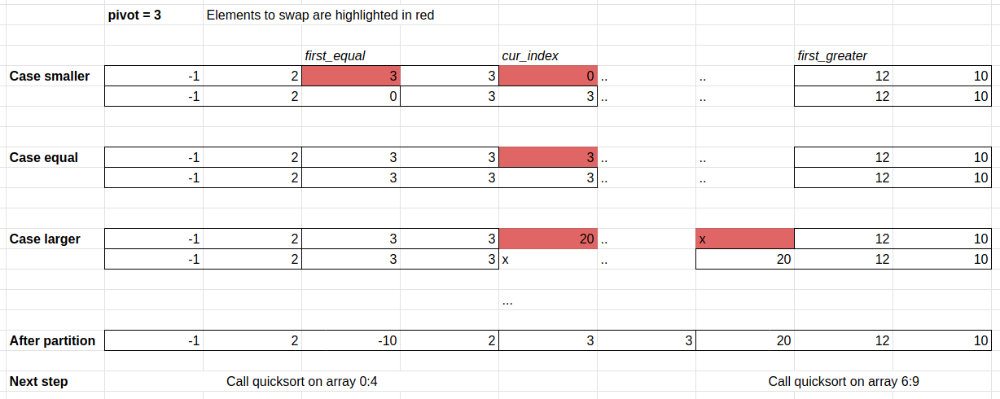

# Binary Search and Quicksort

This week we are covering two algorithms that use the divide and conquer stategy. The strategy consists of breaking down a problem into parts, and solve the parts individually. For example, if explaining a concept to a large group of 10 students is hard, we can break the students into two groups of 5 and explain the concept separately to each of them. This is a common strategy in computer algorithms.

### Binary Search
Excellent video explaining the concept of binary search (don't worry about the Java implementation) <a href="https://www.youtube.com/watch?v=P3YID7liBug">Binary Search Explained</a>

Or you can read my explanation

Let's say we are trying to search for an item in a sorted array. We may be writing a library management software and we want to enable the users to search whether a book is in the library. We can loop through the entire array from start to finish, but this is inefficient and on average takes n/2 lookups. We can be more efficient by drawing inspiration from the same procedure you may take to search for a book in a sorted bookshelf. We can start by looking at the middle of the bookshelf, if our author name is smaller than the middle book's author, we have now reduced the number of books we need to look at by half. Repeat this same process again for the half the bookshelf, dividing it by half again so we only have to look at a quarter of a bookshelf. We can repeat this process until we find the book or have no where to look. This is the idea behind binary search.

#### Comparison with Naive Loop
**Naive Loop**

Works on any array

Time complexity O(n)

**Binary Search**

Works only on a **sorted array**

Time complexity O(log(n))

#### Example code

        #define BS_FOUND 1
        #define BS_NOT_FOUND 0

        int bsearch(int data[], int data_size, int target) {
                int start = 0, end = data_size;
                while (end - start > 0) {
                        int middle = (start + end) / 2;
                        int pivot = data[middle];
                        if (target == pivot) {
                                return BS_FOUND;
                        } else if (target < pivot) {
                                end = middle;
                        } else {
                                start = middle + 1;
                        }
                }
                return BS_NOT_FOUND;
        }

### Quicksort

Quicksort is a sorting algorithm that sorts the array recursively. At each iteration, quicksort aims to partition the array around a pivot value.

A partition is define as dividing the array into three subarrays. One containing all the values smaller than the pivot, one containing all the values larger than the pivot and one containing all values equal to the pivot.

Example

Let Pivot=3 (chosen from the array arbitrarily)

Before partition:  [-1, 10, 3, 12, 2, 3, 0, 20]

After partition: [-1, 0, 2] [3, 3] [10, 12, 20]

The smaller and greater than subarrays are sorted by calling quicksort again.

#### Comparison with Insertion Sort

What is the performance of Quicksort in the best case? We first work out that each partition takes k comparisons, where k is the size of the array being sorted.

To simplify our analysis, we are going to ignore the subarray equal to the pivot and assume that the pivot partitions the array into 2 subarrays (smaller than and equal to), (greater than).

We can visualise recursive calls to quicksort by placing them in levels. The box indicates the subarray being partitioned by one call to quicksort. Each level takes n comparisons. The question is how many levels does quicksort take.

If the pivot value perfectly divides the array into two same-sized subarrays, at most there are log2(n) levels. So the time complexity of quicksort is O(nlog(n)) in the best case.

On average, a random pivot value will divide the input into two subarrays of roughly equal size. So the time complexity is also O(nlogn) on average.

In the worst case, each partition splits the array into two subarrays of size 1 and k-1. In which case our time complexity is O(n^2)

**Quicksort Complexity**

Best: O(nlog(n))

Avg: O(nlog(n))

Worst: O(n^2)

**Insertion Sort Complexity**

Best: O(n)

Avg: O(n^2)

Worst: O(n^2)

#### Implementation
There are many ways to partition an array. We can create three arrays to store the values, or we can partition without extra arrays by swapping values. We are going to look at an algorithm that does the latter, in other words it sorts "in place".

#### Example code

        void swap_int(int *n1, int *n2) {
                int tmp = *n2;
                *n2 = *n1;
                *n1 = tmp;
        }

        void quicksort(int data[], int n) {
                if (n < 2) {
                        return;
                }
                int first_equal = 0, first_greater = n, idx = 0;
                int pivot = data[0];
                while (idx < first_greater) {
                        int element = data[idx];
                        if (element == pivot) {
                                idx++;
                        } else if (element < pivot) {
                                swap_int(&data[first_equal], &data[idx]);
                                first_equal++;
                                idx++;
                        } else {
                                swap_int(&data[first_greater-1], &data[idx]);
                                first_greater--;
                        }
                }

                quicksort(data, first_equal);
                quicksort(data + first_greater, n - first_greater);
        }

