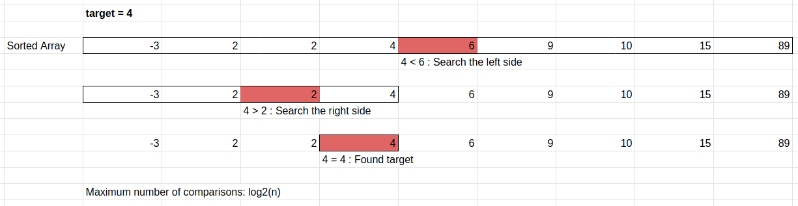

# Binary Search and Quicksort

This week we are covering two algorithms that use the divide and conquer stategy. The strategy consists of breaking down a problem into parts, and solve the parts individually. For example, if explaining a concept to a large group of 10 students is hard, we can break the students into two groups of 5 and explain the concept separately to each of them. This is a common strategy in computer algorithms.

### Binary Search
Excellent video explaining the concept of binary search (don't worry about the Java implementation) <a href="https://www.youtube.com/watch?v=P3YID7liBug">Binary Search Explained</a>

Or you can read my explanation

Let's say we are trying to search for an item in a sorted array. We may be writing a library management software and we want to enable the users to search whether a book is in the library. We can loop through the entire array from start to finish, but this is inefficient and on average takes n/2 lookups. We can be more efficient by drawing inspiration from the same procedure you may take to search for a book in a sorted bookshelf. We can start by looking at the middle of the bookshelf, if our author name is smaller than the middle book's author, we have now reduced the number of books we need to look at by half. Repeat this same process again for the half the bookshelf, dividing it by half again so we only have to look at a quarter of a bookshelf. We can repeat this process until we find the book or have no where to look. This is the idea behind binary search.

Example code of binary search

        #define BS_FOUND 1
        #define BS_NOT_FOUND 0

        int bsearch(int data[], int data_size, int target) {
                int start = 0, end = data_size;
                while (end - start > 0) {
                        int middle = (start + end) / 2;
                        int pivot = data[middle];
                        if (target == pivot) {
                                return BS_FOUND;
                        } else if (target < pivot) {
                                end = middle;
                        } else {
                                start = middle + 1;
                        }
                }
                return BS_NOT_FOUND;
        }

### Quicksort

Example code of quicksort

        void swap_int(int *n1, int *n2) {
                int tmp = *n2;
                *n2 = *n1;
                *n1 = tmp;
        }

        void quicksort(int data[], int n) {
                if (n < 2) {
                        return;
                }
                int first_equal = 0, first_greater = n, idx = 0;
                int pivot = data[0];
                while (idx < first_greater) {
                        int element = data[idx];
                        if (element == pivot) {
                                idx++;
                        } else if (element < pivot) {
                                swap_int(&data[first_equal], &data[idx]);
                                first_equal++;
                                idx++;
                        } else {
                                swap_int(&data[first_greater-1], &data[idx]);
                                first_greater--;
                        }
                }

                quicksort(data, first_equal);
                quicksort(data + first_greater, n - first_greater);
        }

